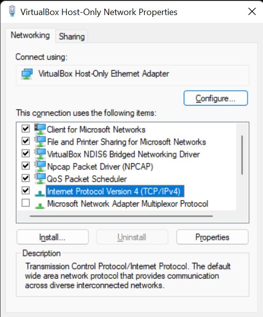

# **Administrasi Sistem**

### Tugas 2

## Kelompok

1. Reza Maulana / 2010131310012
2. Muhammad Gilang Ramadhan / 2010131310005

---
 

## 1. Client Server pada Linux Virtual Box dengan Windows

- langkah 1

Pertama, masuk ke setting pilih Network, disana ada tulisan Attached to klik dan pilih "Host-only" Adapter dan Namenya Pilih "Virtual Host-only Ethernet Adapter" dan di Advanced disana ada Promiscuous Mode pilih "Allow All".

 

- langkah 2

Setelah di setting kita masuk ke terminal debian dan masuk sebagai Super User atau **SU**

 

- langkah 3

Setelah masuk menggunakan SU atau sebagai root, kemudian ketikan nano /etc/network/interfaces untuk mengkonfigurasi IP address server.

 

- langkah 4

Disana tambahkan seperti digambar diatas, Kemudian save dengan cara menekan tombol keyboard “ctrl + x kemudian Y kemudian Enter.

 

- langkah 5

Kemudian reboot service networking dengan cara mengetikan perintah terminal :
/etc/init.d/networking restart

 

- langkah 6.1

Setelah di restart networknya kemudian kita akan mengkonfigurasi IP Address pada Windows (Client).
Buka Control Panel => Network and Internet => Network and Sharing Center => Change Adapter Setting. Kemudian pastikan adapter virtualbox host only dalam keadaan aktif (enable).

 

- langkah 6.2

Pilih "Properties"

 

- langkah 6.3

Pilih "Internet Protocol Version 4 (TCP/IPv4)"

 

- langkah 7

Kemudian masukan IP yang satu subnet (satu network) dengan Ip Debian Server kita dan Klik Ok

 

- langkah 8

Ketika sudah di setting, kita cek untuk clientnya menggunakan ping 192.168.10.2

 

- langkah 9

Dan kita cek menggunakan cmd untuk cek servernya menggunakan ping 192.168.10.1