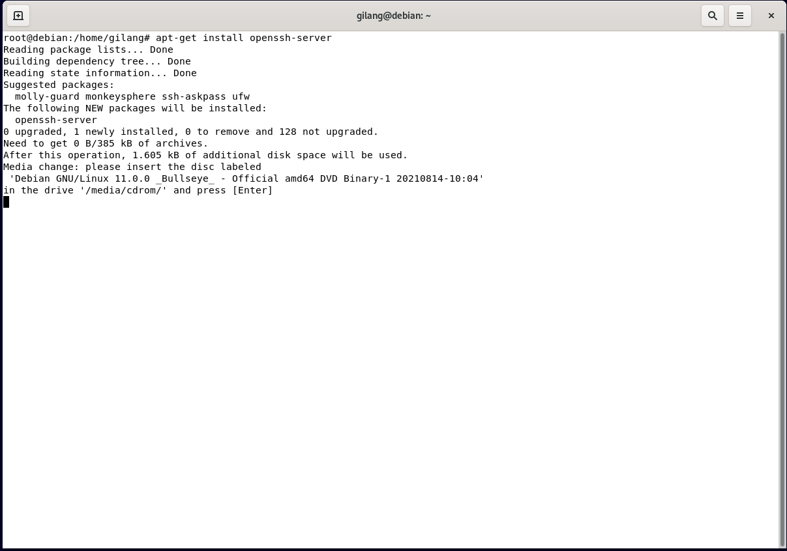
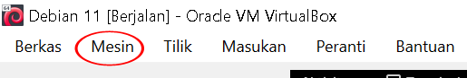
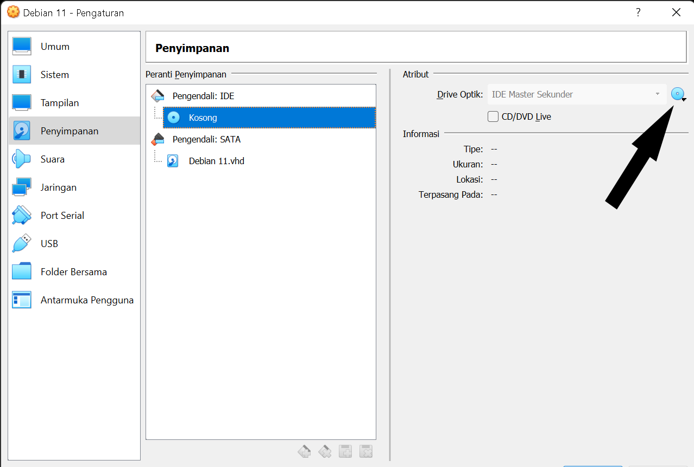
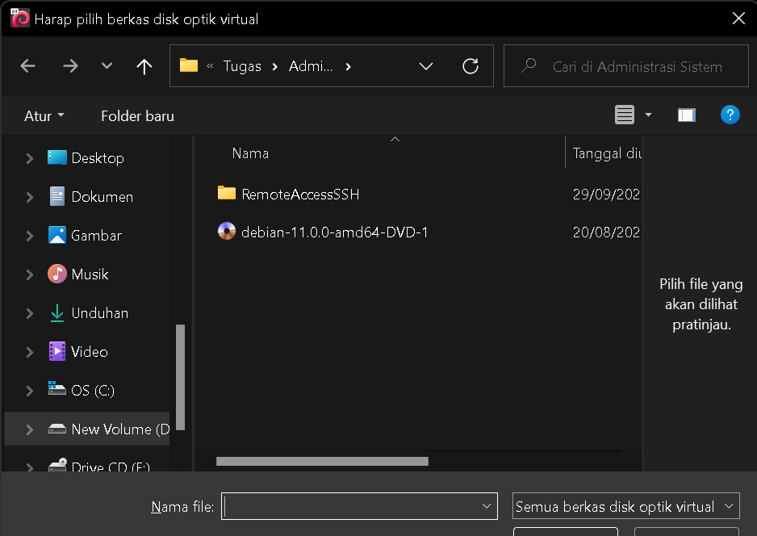
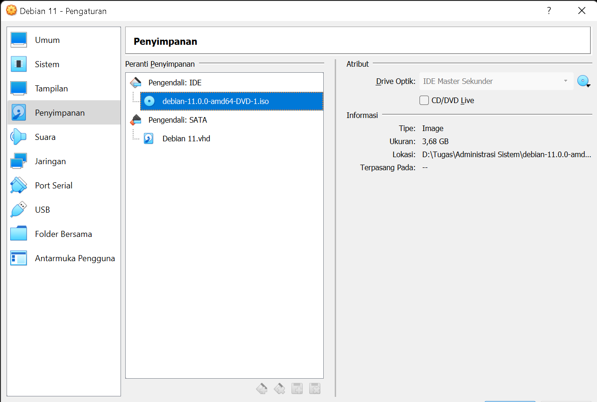
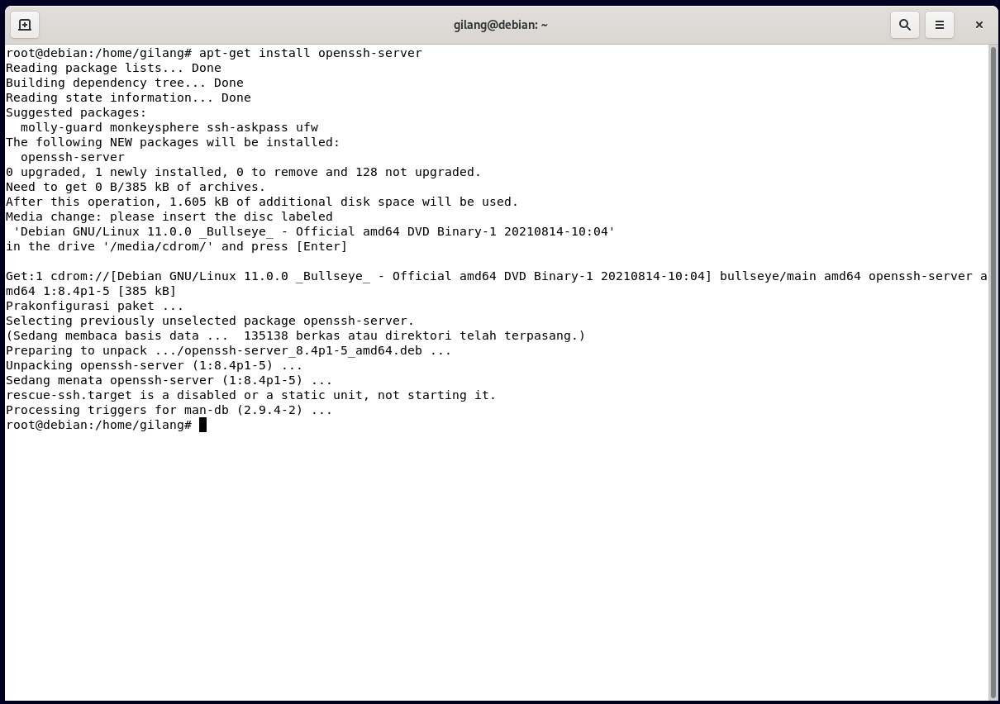
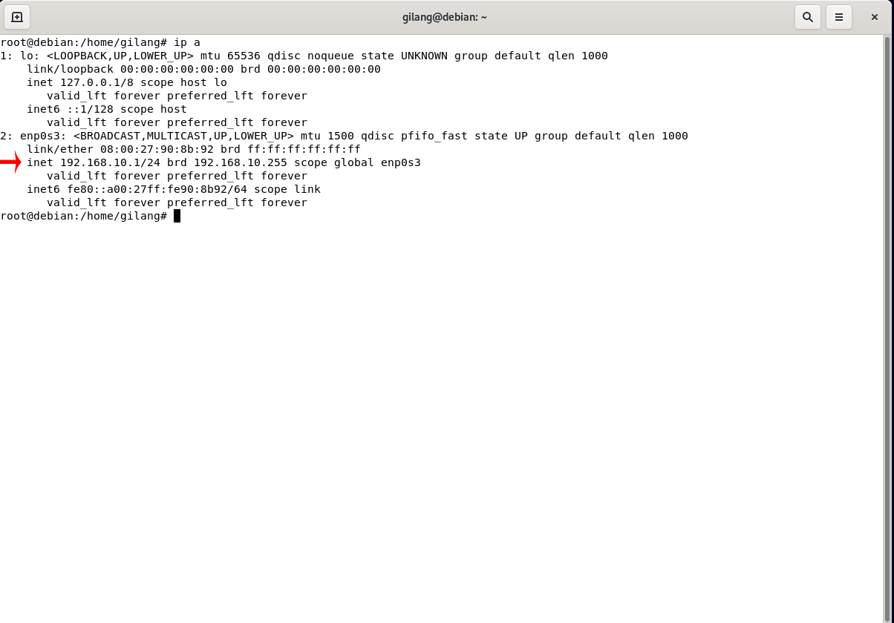
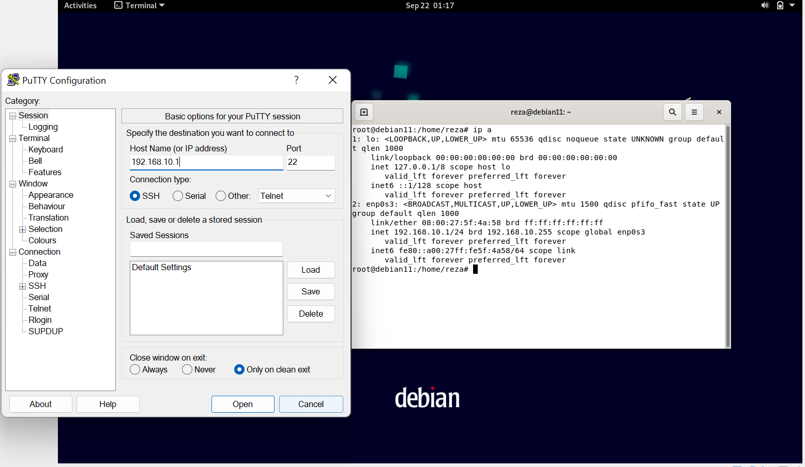
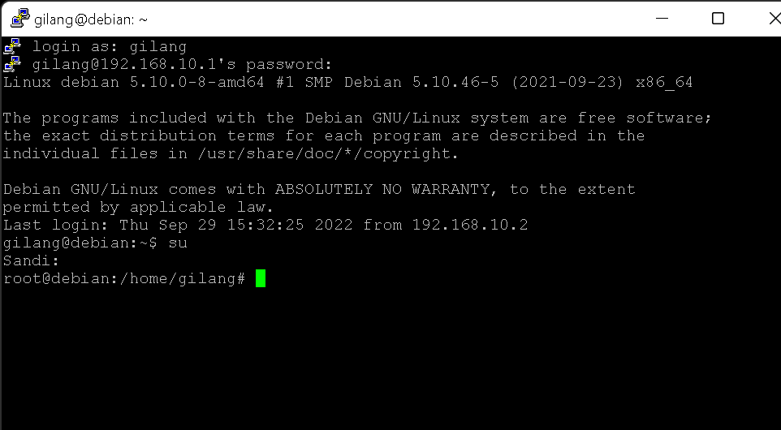

# Tugas Kelompok SSH-Server
**Nama Anggota Kelompok:**

1. Muhammad Gilang Ramadhan (2010131310005)
2. Reza Maulana (2010131310012)

---

## Langkah - Langkah Penginstalan dan Konfigurasi SSH Server

- Langkah 1

Hal pertama yang harus kita lakukan adalah Masuk Debian Linux pada VirtualBox anda, masuk terminal, kemudian masuk sebagai user administrator. Jika sudah login, sekarang untuk penginstalan dengan mengetikkan "apt-get install openssh server" kemudian tekan ENTER.

 

- Langkah 2

Jika proses penginstalan meminta file DVD, masuk ke mesin/machine yang terletak dibagian atas kiri virtual box.

 

- Langkah 3

Pilih Penyimpanan/Storage, lalu klik ikon DVD seperti dalam gambar.

 

- Langkah 4

Cari file DVD sesuai versi OS Linux yang dipakai, pilih file tersebut dan klik "OK"

 

- langkah 5

Disini tahap ini, penginstalan SSH sudah selesai. Selanjutnya kita akan mencoba masuk dari windows ke linux menggunakan aplikasi Putty. Bisa download menggunakan link dibawah  ini : https://www.chiark.greenend.org.uk/~sgtatham/putty/latest.html. 
Kemudian instal seperti biasa anda instal aplikasi lain.

 

- Langkah 6

Kembali ke Debian kita akan cek ip address kita dengan masukkan command "ip a". inet yang bertanda panah warna merah adalah ip address yang akan digunakan ke Putty 

 

- Langkah 7

Masukkan ip address sesuai inet, yaitu 192.168.10.1(sesuikan ip address milik anda) dengan port 22. Lalu klik open.

 

- Langkah 8

Hasil nya anda akan diminta login sesuai SuperUser di debian atau OS Linux yang lain yang anda pakai. Jika berhasil maka client sudah berhasil masuk dengan SSH
