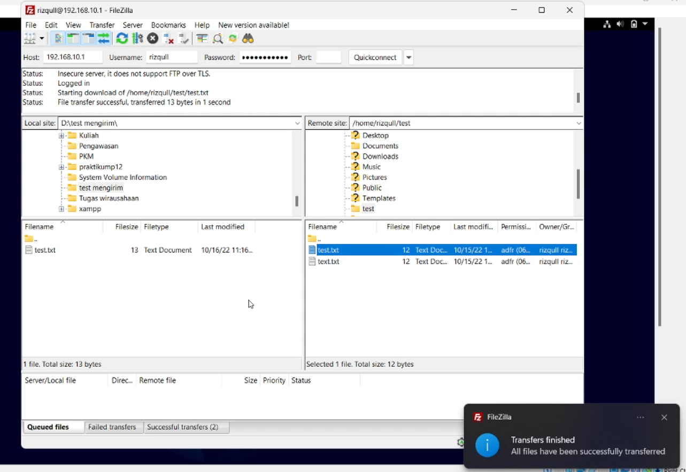

# Tugas Kelompok FTP
**Nama Anggota Kelompok:**

1. Muhammad Gilang Ramadhan (2010131310005)
2. Reza Maulana (2010131310012)

---

## Langkah - Langkah Penginstalan dan Konfigurasi FTP 

- Langkah 1

pertama kita harus Masuk Debian Linux pada VirtualBox, masuk terminal, kemudian masuk sebagai user administrator(SuperUser). Sekarang untuk penginstalan dengan mengetikkan "apt-get install proftpd"

 

- Langkah 2  

Jika sudah terinstall proftpd pada server, Kita membutuhkan aplikasi bernama filezilla untuk melakukukan pengujian ftp pada windows sebagai client. Berikut link download filezilla:  
https://filezilla-project.org/download.php. 
Jika sudah download, instal filezilla seperti aplikasi pada umumnya kemudian jalankan. Selanjutnya Isi kolom Host dengan ip address server linux, Username dan password linux anda, 
port isi saja 21 lalu klik Quickconnect

 

- langkah 3 

Jika sudah download, instal filezilla seperti aplikasi pada umumnya kemudian jalankan. Selanjutnya Isi kolom Host dengan ip address server linux (Untuk mencek ip address server linux tuliskan command "ip a" pada terminal).

 

- Langkah 4 

Isi juga username dan password linux anda, 
port isi saja 21 lalu klik Quickconnect

 

- langkah 5 

Jika sudah terhubung, Kita akan uji coba mengirim file dari server linux ke computer client. Saya akan mengirim file (text.txt) dari server linux ke computer client. 
    1. Pilih file text.txt
    2. drag file dari sebelah kanan ke kiri.

- langkah 6 

Jika file sudah berhasil terkirim akan ada notifikasi bahwa transfer berhasil.