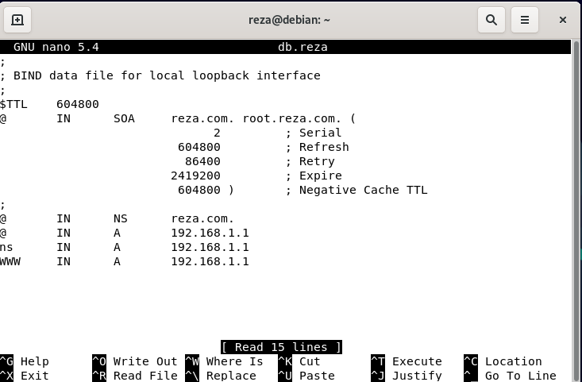

# **Administrasi Sistem**

### Tugas 2

## Kelompok

1. Reza Maulana / 2010131310012
2. Muhammad Gilang Ramadhan / 2010131310005

---
 

## 1. DNS SERVER

- Login ke debian dengan menggunakan user root dengan cara menjalankan command su, setelah itu kita setting IP untuk server terlebih dahulu, ikuti cara berikut 

 
kita cek apakah IP nya udah berganti atau tidak menggunakan "ip a"

 

- Selanjutnya install bind9 pastikan koneksi terhubung dengan internet, bisa dicek dengan menjalankan command ping 8.8.8.8, setelah itu jalankan command apt-get install bind9 jika ada pertanyaan [y/n] klik y kemudian enter. Untuk memastikan instalisasi sudah berhasil jalankan command apt-get install bind9 maka tampilannya akan seperti berikut :

 

Kemudian masuk ke directory bind dengan command cd /etc/bind Berikut file-file penting yang akan kita konfigurasi dalam DNS Server a. File forward b. File reverse c. named.conf.options d. named.conf.local e. /etc/resolv.conf
- Pertama membuat file forward, file forward berfungsi untuk konversi dari DNS menjadi IP Address, Caranya copy file db.local dengan command cp db.local db.reza kemudian konfigurasi file db.reza dengan command nano db.reza, Lakukan konfigurasi seperti pada gambar berikut :

 

- Kemudian membuat file reverse, file reverse berfungsi untuk konversi dari IP Address menjadi DNS, misalnya jika kita mengetikkan ip address http://192.168.1.1 pada web browser, secara otomatis akan redirect ke alamat www.reza.com. Caranya copy file db.127 dengan command cp db.127 db.192 kemudian konfigurasi file db.192 dengan command nano db.192, Lakukan konfigurasi seperti pada gambar berikut :

 

Kemudian membuat Zone Domain. Edit tambahkan konfigurasi untuk forward dan reverse pada file named.conf.options dan named.conf.local.
- Langkah pertama kita konfigurasi pada file named.conf.options dengan command nano named.conf.options kemudian ubah konfigurasinya sepeti gambar dibawah ini yang diberi tanda merah.

 

- Kemudian langkah kedua kita konfigurasi named.conf.local dengan command nano named.conf.local kemudian tambahkan konfigurasinya seperti gambar dibawah ini :

 

- Menambah dns-name server. Tambahkan dns dan nameserver dari server Debian tersebut pada file resolv.conf. agar dapat diakses melalui komputer kita. Jalankan command nano /etc/resolv.conf jika sudah selesai konfigurasi restart bind9 dengan command /etc/init.d/bind9 restart atau bisa di restart manual.

 

- Sebelum melakukan pengujian DNS Server nya, kita install terlebih dahulu dnsutils dengan perintah apt-get install dnsutils. Jika ada pertanyaan [y/n] tekan y lalu enter. Kemudian lakukan pengujian dengan command nslookup reza.com dan nslookup 192.168.1.1 jika berhasil maka akan seperti gambar dibawah ini.

 

- Untuk pengujian selanjutnya bisa menggunakan command dig yang dilakukan pada local server. Silahkan jalankan command dig futra.com jika berhasil maka akan muncul seperti gambar dibawah ini

kalau udah bisa maka udah berhasil.