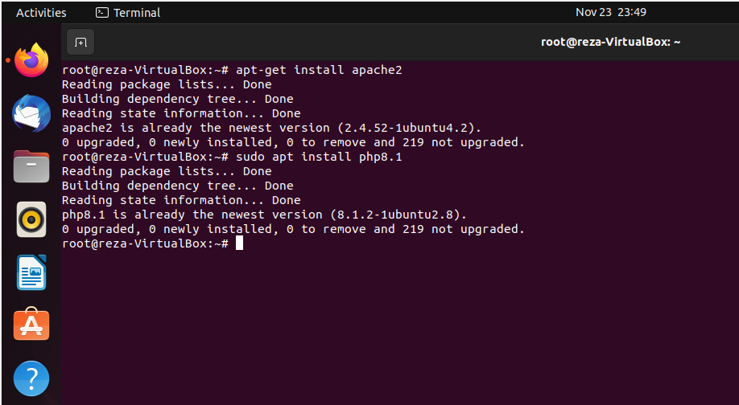

# Tugas Kelompok WEB SERVER
**Nama Anggota Kelompok:**

1. Reza Maulana (2010131310012)
2. Muhammad Gilang Ramadhan (2010131310005)

---

## Langkah - Langkah Penginstalan dan Konfigurasi 

- Login ke debian dengan menggunakan user root dengan cara menjalankan command su atau sudo -i setelah itu jalankan command apt-get install apache2 untuk menginstall apache.

 

- kalau sudah terinstall, lanjut menginstall Bahasa pemrograman php dengan cara menjalankan command apt-get install php8.1(php8.1 artinya php versi 8.1) jika gagal coba jalankan command sudo apt -y install php8.1.

 

- Selanjutnya konfigurasi, kita bisa melihat hasilnya dengan mengunjungi web browser dan mengetikkan alamat IP server kita (jalankan command ip a untuk melihat IP server). Maka akan muncul seperti gambar dibawah ini.

 

- Untuk modul ini kita akan menguji menggunakan script php untuk menampilkan info php pada server kita, Kita akan membuat skrip php pada folder /var/www. Silahkan jalankan command nano /var/www/html/test.php. Setelah itu masukkan skrip seperti pada gambar berikut :

 

- Buka browser linuxnya dan search (IP server kalian)/test.php. Maka akan muncul laman tentang info dari php yang kita install pada server

kalau udah bisa seperti ini maka sudah berhasil.