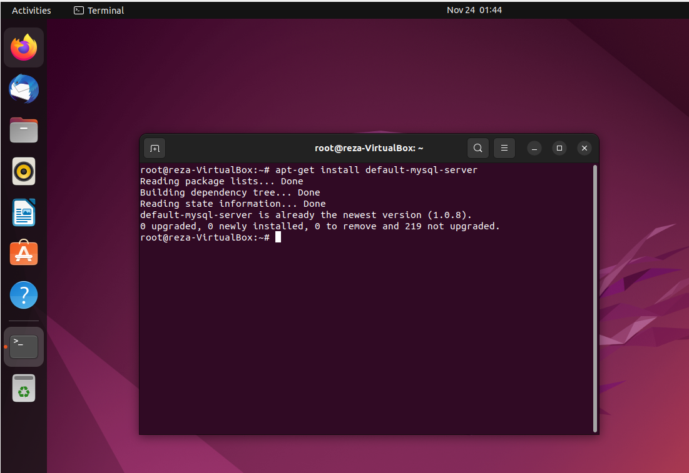
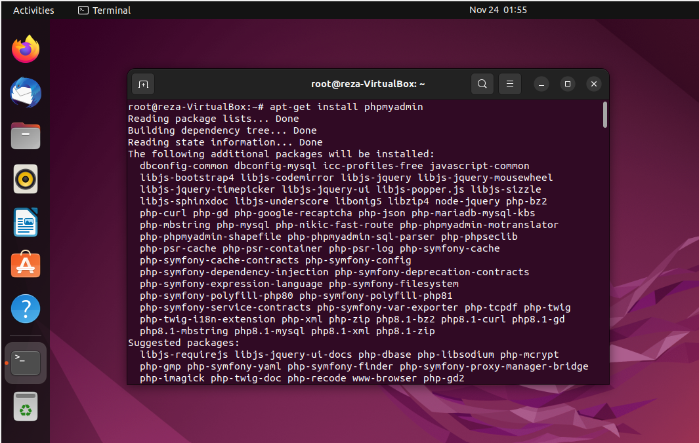
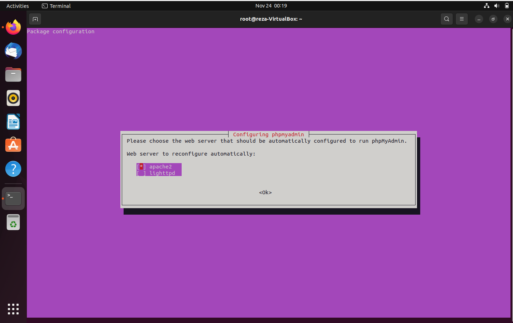
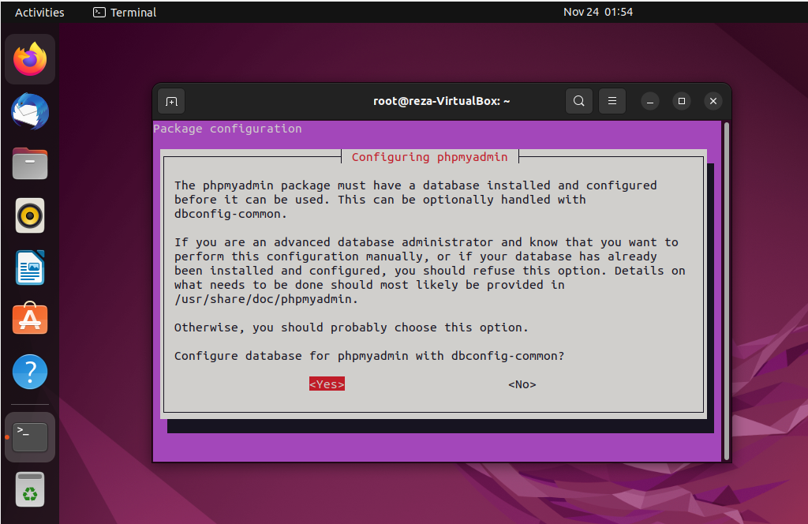
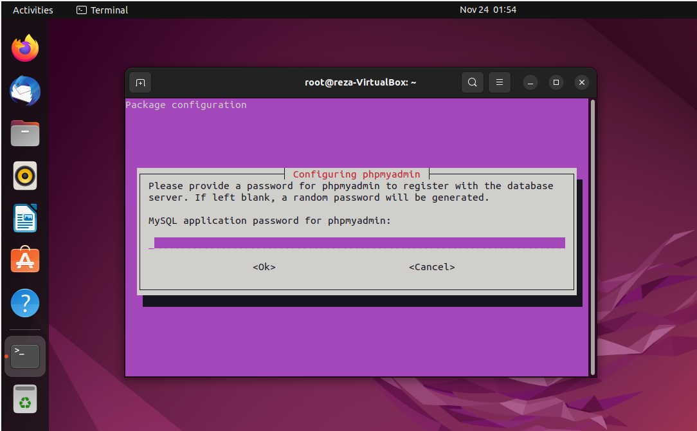
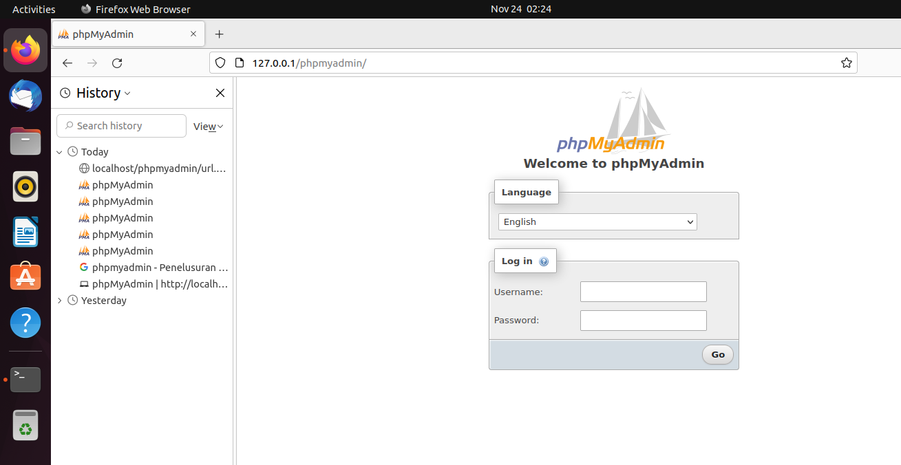
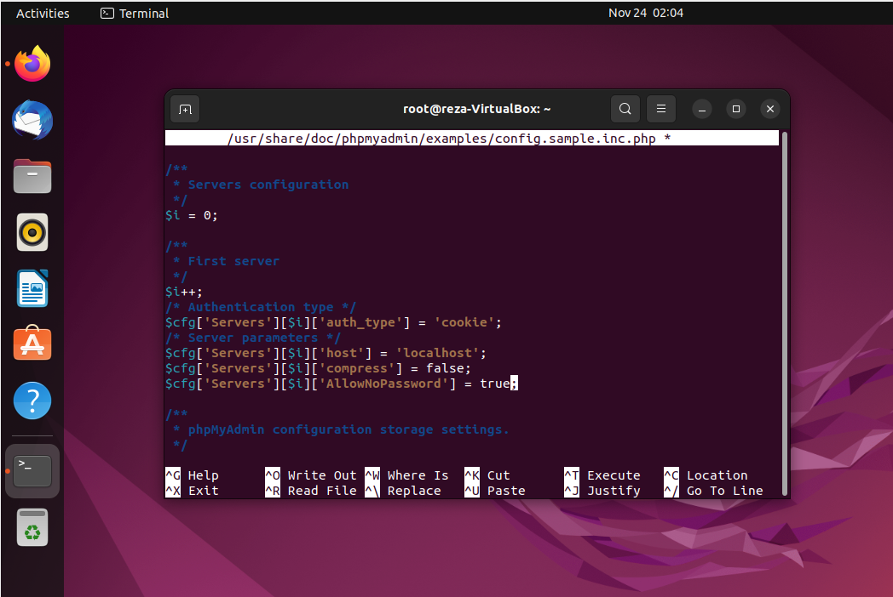
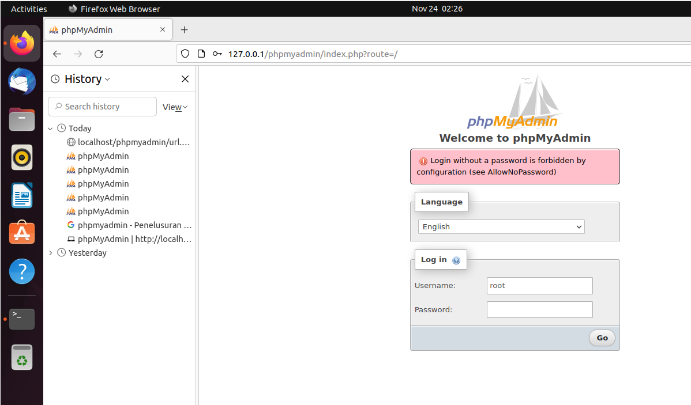

# Tugas Kelompok DATABASE SERVER
**Nama Anggota Kelompok:**

1. Reza Maulana (2010131310012)
2. Muhammad Gilang Ramadhan (2010131310005)

---

## Langkah - Langkah Penginstalan dan Konfigurasi 

- Login ke debian dengan menggunakan user root dengan cara menjalankan command su atau sudo -i setelah itu jalankan command apt-get install default-mysql-server untuk menginstall.

 

- Kalau sudah terinstall, selanjutnya adalah menginstall phpmyadmin, aplikasi ini digunakan untuk memudahkan user yang tidak terbiasa dengan command line karena aplikasi ini menggunakan GUI. Untuk menginstallnya silahkan jalankan command apt-get install phpmyadmin. Pilih apache2 sebagai web server yang digunakan.

klik "Space" untuk memilih apache2 seperti gambar dibawah

Pada form di bawah pilih "Yes"

Setelah itu kalian akan diminta untuk memasukkan root password dan konfirmasi password pada saat installasinya berjalan.

 

- Selanjutnya adalah pengujian, Silahkan kalian buka browser dalam linuxnya lalu ketikkan alamat (IP server kalian)/phpmyadmin.

Disini saya coba masuk tapi tidak bisa. Jadi saya coba untuk mengubah untuk tidak memakai password menggunakan command **nano /usr/share/doc/phpmyadmin/examples/config.sample.inc.php** dan ubah pada bagian **AllowNoPassword** dan kasih **true** seperti gambar berikut.

Saya coba lagi untuk masuk dan masih tidak bisa

